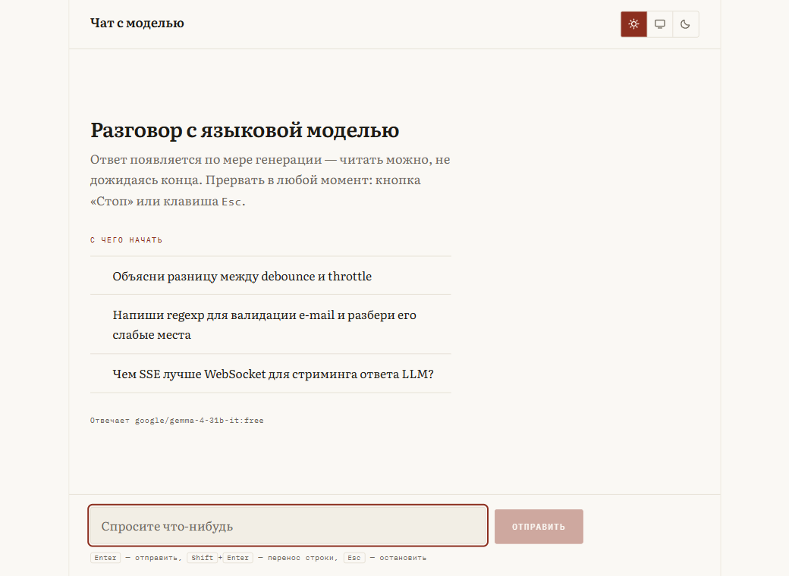
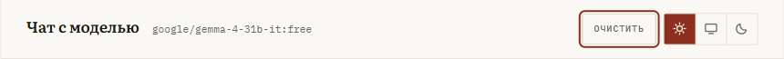
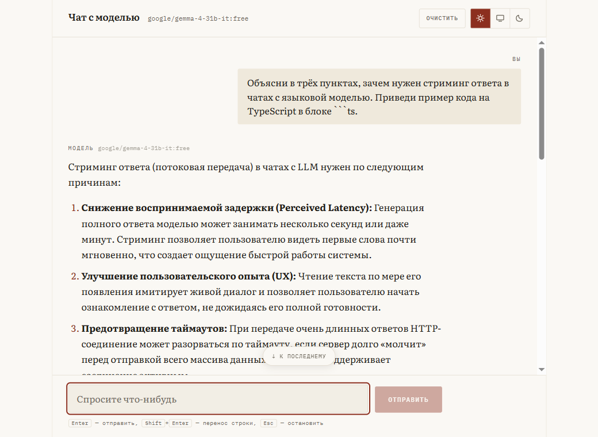
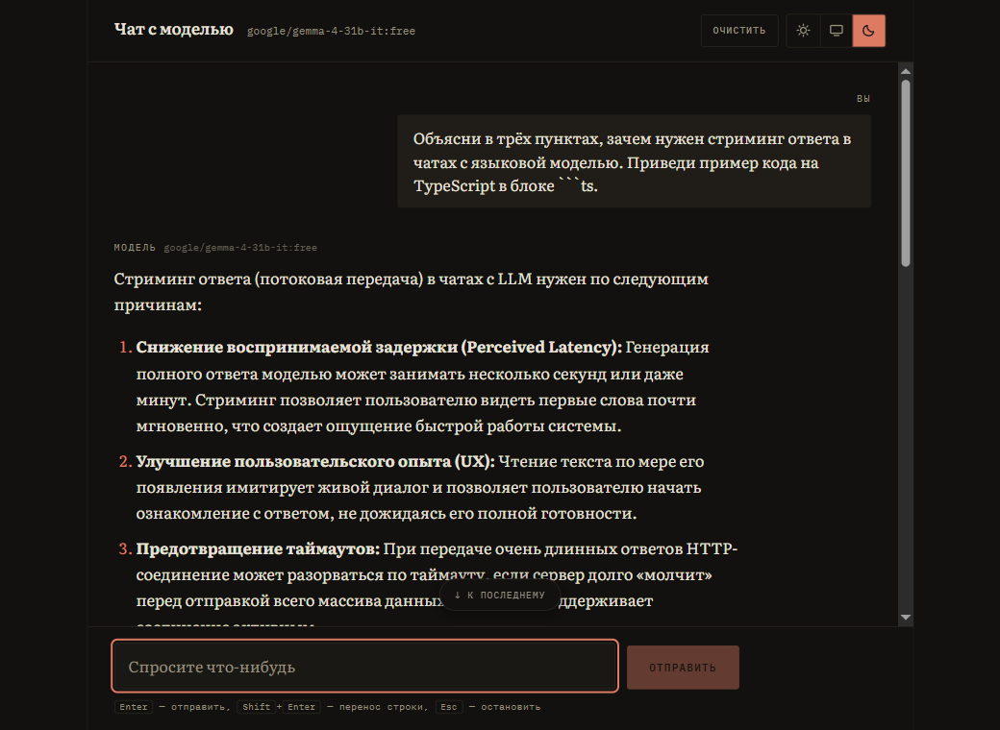
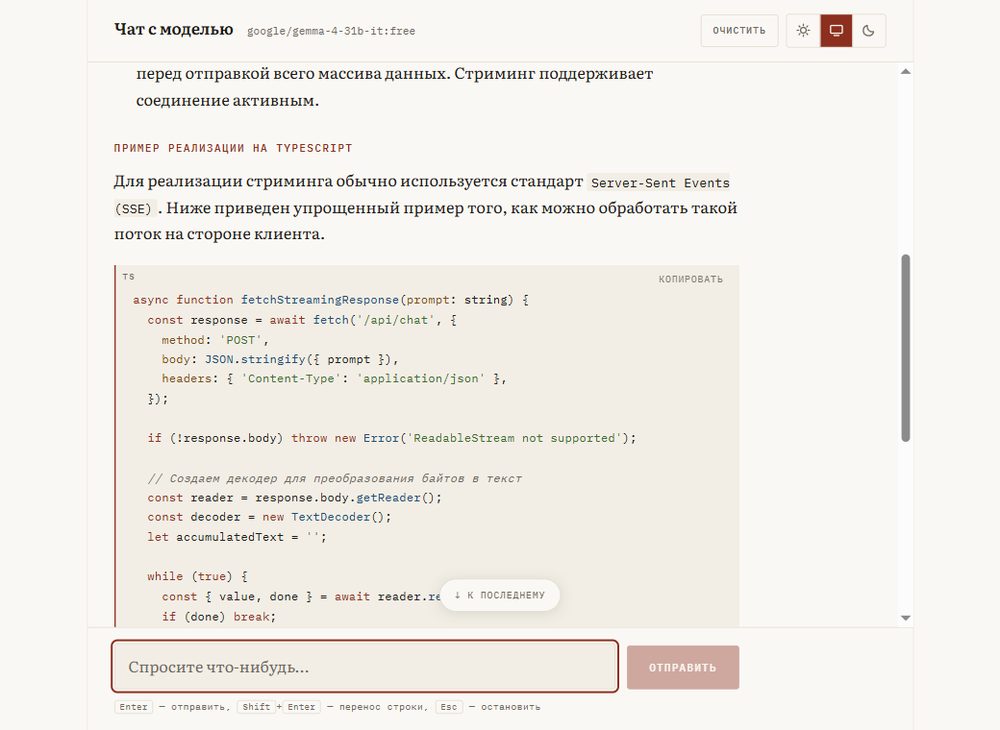
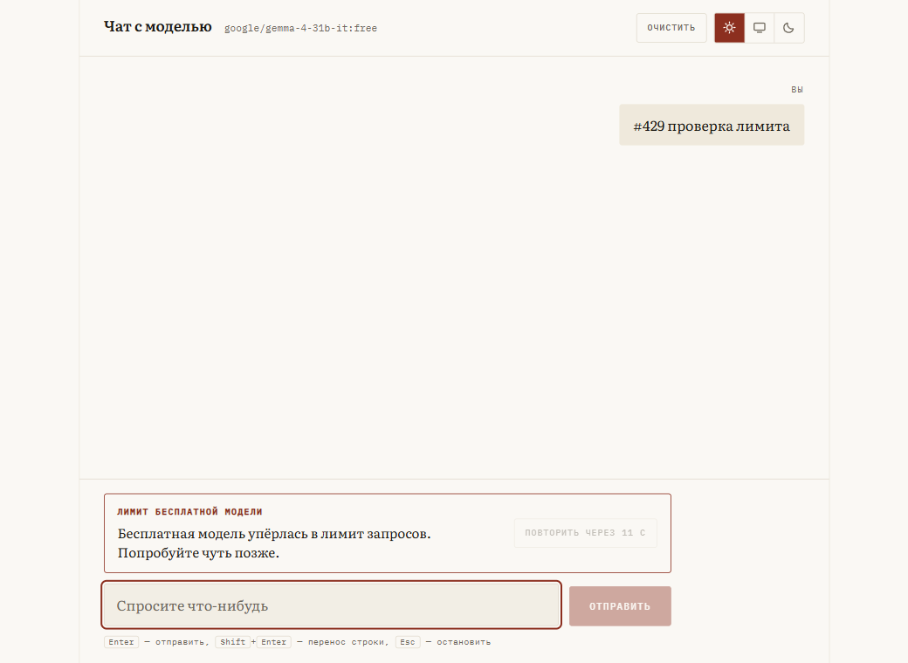
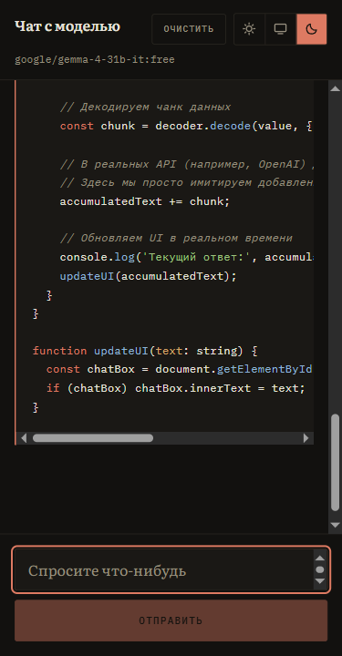

# Чат с языковой моделью

Одностраничный веб-чат поверх OpenRouter: потоковый ответ, обрыв генерации
на середине, внятные состояния на каждой аварии. Ключ живёт на сервере и в
браузер не попадает.

React 19 + TypeScript + Vite · Node + Hono · SSE

[](https://github.com/LiliShiz/ai-chat/actions/workflows/ci.yml)



---

## Запуск за пять минут

```bash
git clone <этот-репозиторий>
cd ai-chat
npm install

cp .env.example .env        # Windows: copy .env.example .env
# впишите в .env ключ с https://openrouter.ai/keys

npm run dev
```

Открыть **http://localhost:5173**. Всё.

Нужен Node ≥ 20.6 (используется `--env-file`). Проверялось на Node 23.

> **Если модель ответила «This model is unavailable for free»** — значит
> она уехала из бесплатного каталога (так уже случилось с
> `deepseek-chat-v3-0324` прямо по ходу работы). Возьмите любую живую:
> ```bash
> curl -s https://openrouter.ai/api/v1/models \
>   | jq -r '.data[] | select(.id | endswith(":free")) | .id'
> ```
> и впишите в `OPENROUTER_MODEL`. Правка кода не нужна.

### Посмотреть, как выглядят аварии, — без ключа

В репозитории есть поддельный OpenRouter. Он нужен, потому что 429, таймаут
и обрыв связи на живом апстриме ловятся «когда повезёт», а проверять
обработку ошибок по случайному совпадению — значит не проверять её вовсе.

```bash
npm run dev:mock
```

Дальше просто пишите в чат сообщение с маркером:

| Маркер | Что произойдёт |
|--------|----------------|
| *(без маркера)* | Обычный ответ с markdown, списком и блоком кода |
| `#long` | Длинный ответ — удобно жать «Стоп» |
| `#429` | Лимит бесплатной модели + `Retry-After` и обратный отсчёт |
| `#timeout` | Соединение открыто, ответа нет — сработает сторожевой таймер |
| `#stall` | Стрим начался и замолчал — сработает idle-таймер |
| `#cut` | Жёсткий обрыв посреди стрима |
| `#error` | Ошибка приходит событием внутри уже открытого потока |

### Команды

| Команда | Что делает |
|---------|-----------|
| `npm run dev` | Прокси (8787) + фронт (5173) |
| `npm run dev:mock` | То же, но поверх поддельного апстрима — ключ не нужен |
| `npm run build` | Сборка фронта в `web/dist` |
| `npm start` | Прод-режим: сервер отдаёт собранный фронт с того же origin |
| `npm test` | Тесты сервера и фронта (56 штук) |
| `npm run typecheck` | Проверка типов сервера и фронта |

---

## Ключевые решения

### Где живёт ключ

Браузер знает ровно два адреса: `/api/health` и `/api/chat`. Ключ читается
из окружения в `server/src/config.ts` и не покидает процесс — его нет ни
в бандле, ни в одном запросе со страницы.

В dev это не иллюзия из-за CORS: Vite проксирует `/api` на сервер, так что
во вкладке Network видно ровно то же, что будет в проде — свой origin и ни
одного обращения к `openrouter.ai`.

```
браузер ──POST /api/chat──▶ Vite (dev) ──▶ Hono :8787 ──▶ openrouter.ai
        ◀────── SSE ───────                             (здесь и только
                                                         здесь есть ключ)
```

### Почему прокси не отдаёт формат OpenAI как есть

Соблазнительно просто пробросить байты апстрима в браузер. Я разбираю SSE
на сервере и отдаю свой, узкий протокол из трёх событий:

```ts
{ type: 'delta',  text: string }
{ type: 'done',   reason: 'stop' | 'length' | 'unknown' }
{ type: 'error',  error: { code, message, retryable, retryAfterSec? } }
```

Две причины. Первая: фронт не должен знать, какой провайдер стоит за
прокси — смена модели или провайдера не должна трогать клиент. Вторая
важнее и описана ниже.

### Ошибка — это событие в потоке, а не HTTP-статус

Ответ 429 до начала генерации ещё можно отдать статусом. Но лимит может
прилететь **после** двадцати уже полученных токенов, а сеть — оборваться на
середине. Статус к тому моменту уже отправлен (`200 OK`), менять его поздно.

Поэтому ошибка приезжает отдельным событием поверх уже открытого потока.
Клиент дорисовывал текст по мере поступления — значит, полученный кусок
никуда не девается, и рядом с ним появляется объяснение, что случилось.
Ровно это требует ТЗ от кнопки «Стоп», и ровно это правильно для аварий.

### Отмена доходит до апстрима

`AbortController` прошит насквозь: кнопка «Стоп» → `fetch` на клиенте →
`c.req.raw.signal` в Hono → `fetch` к OpenRouter. Не «спрятать текст в UI»,
а действительно прекратить генерацию: иначе модель продолжает считать
токены в пустоту и жечь и без того скромную бесплатную квоту.

### Два таймаута вместо одного

Один общий таймаут на запрос — плохая идея: длинный честный ответ и
зависшее соединение выглядят для него одинаково. Здесь их два:

- **ожидание первого токена** (45 с) — бесплатные модели часто стоят в очереди;
- **пауза между токенами** (30 с) — сторож перезаводится на каждом чанке.

Пока модель печатает, соединение считается живым сколько угодно долго.

### История: `sessionStorage`

ТЗ отдаёт это решение кандидату. Мой выбор и почему:

- **«Не хранить вовсе»** отпадает сразу: случайный F5 или свайп «назад» на
  телефоне стирает весь диалог. Это не фича, это потеря данных.
- **`localStorage`** живёт вечно и глобально для origin. В переписку с LLM
  люди вставляют рабочий код, письма, персональные данные. Оставлять их на
  машине до ручной очистки — плохой дефолт, особенно если машина общая.
- **`sessionStorage`** даёт ровно то, что просит формулировка «в рамках
  сессии»: переживает перезагрузку и навигацию, умирает вместе с вкладкой,
  не течёт в соседние вкладки.

Долгая история — это уже не storage, а аккаунт и сервер, с явным
управлением и кнопкой «удалить». Это другая задача.

### Оформление: почему антиква, а не пузыри

Ответ языковой модели — это текст, который читают: абзацы, списки,
блоки кода, иногда на три экрана. Всё, что делает интерфейс чата
«мессенджером» — пузыри, скругления, аватарки — этому мешает: пузырь
сообщает «прими сообщение», а не «прочитай материал».

Поэтому здесь:

- **Ответ модели набран как статья.** Антиква (Literata), кегль 17px,
  интерлиньяж 1.68, мера 66 знаков. Никакой карточки и рамки вокруг —
  текст стоит прямо на полосе.
- **Плашка осталась только у реплики человека.** Она короткая, её не
  читают — её опознают. Тут форма как раз уместна.
- **Всё служебное набрано моноширинным.** Шапка, метки авторства,
  подзаголовки внутри ответа, кнопки, подсказки. Иерархию держит
  шрифт, а не рамки и заливки: приборы выглядят как приборы, текст —
  как текст.
- **Один акцентный цвет** — кирпичный. Им набраны рубрики, маркеры
  списков и ключевые слова в коде. Второго цвета в интерфейсе нет.

До этого варианта я сделал четыре черновых направления (терминал,
редакция, «тёплый SaaS» и гибрид) и сравнил их на одном и том же
диалоге — макеты лежат в `.planning/sketches/`, открываются как
обычные HTML-файлы.

### Тема: три состояния и одна строка CSS

Переключатель даёт **светлую, тёмную и системную**. Тумблер на два
положения я сознательно не делал: он навсегда отвязывает интерфейс от
настройки ОС, а человек, у которого система вечером уходит в тёмную,
ждёт того же и здесь.

Применяется это одним свойством. Все токены объявлены через
`light-dark()`, который читает `color-scheme` — значит, чтобы сменить
тему, достаточно поменять `color-scheme` на `<html>`. Бонусом
перекрашиваются скроллбары и системные элементы формы, которые иначе
пришлось бы стилизовать руками.

Тёмная тема — не инверсия светлой: бумага становится тёплым углём,
кирпич светлеет до терракоты, подсветка кода пересчитана отдельно.

Выбор темы лежит в `localStorage`, а история диалога — в
`sessionStorage`. Асимметрия намеренная: тема это настройка
интерфейса без личных данных, её логично помнить долго; переписка —
содержимое, и оно не должно переживать сессию (см. выше).

Чтобы страница не моргала светлой при выбранной тёмной, тема
применяется крошечным инлайновым скриптом в `<head>` — до того, как
React успеет смонтироваться.

### Шрифты локальные

`@fontsource` вместо ссылки на Google Fonts: нет запроса к третьей
стороне, нет зависимости от чужого аптайма и нет утечки IP
пользователя в чужую аналитику. Браузер скачивает только нужные
подмножества — за это отвечает `unicode-range` в пакетах.

### Мелочи, которые заметны только в работе

- Токены копятся в `ref` и выливаются в state один раз за кадр
  (`requestAnimationFrame`). Без этого каждый токен перерисовывает всю ленту.
- При остановке дописывается хвост буфера — иначе терялись бы последние
  символы ровно в момент нажатия «Стоп».
- Автопрокрутка работает, только если пользователь и так внизу. Иначе
  нельзя перечитать начало длинного ответа: лента утаскивает вниз.
- Пустой ответ при ошибке убирается из ленты, а сообщение пользователя
  остаётся — «Повторить» отправляет именно его.
- Стоит отлистать вверх — лента замирает и показывает кнопку
  «К последнему». Без этого нельзя перечитать начало длинного ответа:
  каждый новый токен утаскивал бы обратно вниз.
- Действия над ответом (копировать, перегенерировать) проявляются по
  наведению на мыши и всегда видны на тач-устройствах, где наведения
  не существует.
- Блок кода подписан языком и копируется одной кнопкой. Автоопределение
  языка выключено намеренно: на обрывке кода посреди стрима оно
  регулярно угадывает не тот язык и перекрашивает блок на лету.
- Пока не пришёл первый токен, на месте ответа пульсируют три точки.
  Одинокий курсор на пустой строке читается как «сломалось», а не как
  «модель думает».
- Самая тяжёлая часть бандла — markdown с подсветкой — вынесена
  в отдельный чанк и подгружается в простое, пока человек читает
  пустое состояние. К первому ответу она уже на месте.

---

## Тесты

```bash
npm test
```

56 тестов, Vitest. Они покрывают не «рендерится без падения», а то,
что реально ломается — края, ради которых это задание и написано.

**Сервер (26).** Разбор SSE: кадр, разорванный между сетевыми
чанками; keep-alive комментарии `: OPENROUTER PROCESSING`; битый JSON
в кадре. Маппинг ошибок: 429 с `Retry-After`, 401 без утечки наружу
того, что дело в ключе, 5xx как временная. Отдельно — главное
свойство протокола: **ошибка посреди потока приходит после уже
отданного текста**, а не вместо него. Отмена: «Стоп» завершает поток
молча, без события ошибки, и рвёт соединение с апстримом. Сторожевой
таймер на молчащий апстрим проверяется фальшивыми таймерами, без
реального ожидания в 45 секунд.

Маршруты: валидация запроса (семь видов негодного тела, включая
попытку подсунуть роль `system` — системный промпт задаёт сервер),
честный 503 без ключа, заголовок `X-Accel-Buffering: no` и проверка,
что ключ уходит ровно в одном месте — в заголовке к апстриму.

**Фронт (30).** Чтение потока: сборка текста из кусков, не совпадающих
с границами кадров; ошибка после частичного текста; отмена как
отдельный исход, а не ошибка; выключенная сеть, при которой запрос
вообще не уходит. История: живёт в `sessionStorage`, а не в
`localStorage`; переживает перезагрузку; не падает на мусоре и
отсеивает записи чужого формата; переживает недоступное хранилище.

Машина состояний диалога: остановка сохраняет полученный кусок и
помечает ответ прерванным; обрыв до первого токена не оставляет
пустой пузырь; после ошибки вопрос остаётся на месте, чтобы
«Повторить» отправил именно его; повтор отрезает неудачный ответ;
модели уходит вся история, но только роль и текст, без служебных
полей.

Сами тесты проверены мутацией — набор, который проходит при сломанном
коде, хуже, чем его отсутствие:

| Что ломал | Что упало |
|---|---|
| Флаг «остановлено» в `useChat` | Тест про сохранение прерванного ответа |
| Обе проверки `if (clientSignal.aborted) return` в `openrouter.ts` | Два теста про отмену |
| Сверка контроллера на идентичность в конце `run()` | Тест про «Стоп → сразу отправить» |

Первая версия набора этой проверки не прошла бы: тест на отмену был
вакуумным — мок завершался штатно, и ошибке всё равно неоткуда было
взяться. Переписан так, чтобы апстрим при отмене рвал тело, как в
жизни; рядом стоит контрольный тест, что точно такой же разрыв **без**
сигнала отмены обязан доехать событием ошибки.

CI (`.github/workflows/ci.yml`) гоняет `typecheck`, тесты, сборку и
дымовой прогон прод-режима: поднимает `npm start`, дёргает
`/api/health` и проверяет, что по `/` отдаётся собранный фронт.
Последний шаг появился не просто так — см. ИИ-лог, пункт 12.

## Что я сделал иначе, чем написано в ТЗ

### Обводка фокуса

> «Уберите стандартную браузерную обводку фокуса (`outline`) у кнопок и поля
> ввода — в разных браузерах она выглядит разнобойно и портит аккуратный вид.»

Это требование противоречит другому требованию того же ТЗ:

> «Доступность: интерфейсом можно полноценно пользоваться с клавиатуры —
> Tab по элементам…»

Убрать `outline` и ничего не дать взамен — значит сделать клавиатурную
навигацию непригодной: человек жмёт Tab и не понимает, где находится.
Это прямое нарушение WCAG 2.4.7 Focus Visible (уровень AA) и, в отличие
от «разнобойного вида», ломает не эстетику, а работоспособность.

**Что сделано.** Дефолтная обводка снята — та самая, которая выглядит
по-разному в Chrome, Safari и Firefox и портит вид. Вместо неё свой
`:focus-visible`: аккуратное кольцо в цвет интерфейса, одинаковое во всех
браузерах. Ключевое — именно `:focus-visible`, а не `:focus`: кольцо
появляется при навигации с клавиатуры и не появляется при клике мышью.
Есть вариант под `prefers-contrast: more`.



Так требование выполнено по существу (разнобойной обводки нет, вид
аккуратный), а доступность не сломана. Считаю это единственным разумным
прочтением; выполнить буквально означало бы выполнить одно требование
ценой другого.

### Ещё две мелочи на ту же тему

- **Поле ввода — `textarea`, а не `input`.** ТЗ говорит «поле ввода», но
  Shift+Enter для переноса строки в `input` не сделать, а без него чат
  неудобен для любого текста длиннее фразы.
- **`role="alert"` на блоке ошибки.** В ТЗ этого нет, но требование
  «пользователь видит понятное состояние» для незрячего пользователя
  выполняется только так: иначе про ошибку он узнает, лишь добравшись до
  неё табом.

---

## Что не вошло и что сделал бы за ещё день

- **E2E.** Юнит-тесты есть (см. выше), а браузерных сценариев нет:
  «отправил → стоп на середине → текст остался» и «429 → повтор»
  проверялись руками через поддельный апстрим. Playwright закрыл бы
  это двумя короткими сценариями.
- **Живой таймаут и настоящий offline.** Оба состояния проверены
  на моке и в юнит-тестах фальшивыми таймерами, но не на реальной
  зависшей модели и не переключением сети в DevTools.
- **Реальное устройство.** Мобильная вёрстка смотрелась в эмуляции
  Chrome на 375 и 390px; на живом телефоне я её не открывал.
- **Ретрай с экспоненциальной задержкой** на 429 и 5xx — сейчас повтор
  ручной, кнопкой. Для бесплатных моделей автоматический бэкофф с
  уважением к `Retry-After` был бы уместнее.
- **Выбор модели из UI.** Каталог `:free`-моделей у OpenRouter меняется,
  и захардкоженная в `.env` модель однажды исчезнет. Правильнее тянуть
  `/api/v1/models`, фильтровать по `:free` и давать выбрать.
- **Вес бандла.** Основной чанк 239 КБ (75 КБ gzip), markdown с
  подсветкой вынесен в отдельный на 337 КБ (102 КБ gzip) и грузится
  лениво. Львиная доля второго — `highlight.js`, который тянет разбор
  всех языков подряд. Если бы мерил бюджет всерьёз, зарегистрировал бы
  в `lowlight` штук шесть нужных языков вместо полного набора — это
  срезало бы чанк в разы.
- **Виртуализация ленты.** На тысяче сообщений DOM начнёт тормозить.
  В рамках «истории сессии» это не проблема, но при долгой истории — да.
- **Остановка не сохраняет причину.** Сейчас у прерванного ответа
  есть пометка «остановлено вами», но нельзя продолжить с того же
  места — только перегенерировать целиком.

---

## Как я это делал

Процесс велся по GSD: `.planning/` лежит в репозитории и коммитится вместе
с кодом — там контекст проекта, требования с ID, дорожная карта на четыре
фазы и журнал решений. Это не украшение: требования из `.planning/REQUIREMENTS.md`
привязаны к фазам, а фазы — к веткам и PR.

Ветки и коммиты атомарные, по смыслу; история читается сверху вниз как
рассказ о том, что происходило.

### ИИ-лог

Писал с **Claude Code** (модель Opus). Архитектуру, протокол между фронтом
и прокси и все решения из раздела выше формулировал сам; ИИ писал код,
я ревьюил каждую строку и правил. Что реально пошло не так:

**1. Вёрстка уезжала по горизонтали на 360px.**
Сгенерированный грид `.app` имел `grid-template-rows`, но не
`grid-template-columns`, из-за чего единственная колонка бралась по
`max-content` шапки (заголовок + статус + кнопка в одну строку). На
десктопе всё выглядело идеально; на 360px документ становился шире
вьюпорта на 76 пикселей и уезжала вся лента, не только шапка.
Поймал не глазами, а замером: открыл страницу в вьюпорте 375px и сравнил
`documentElement.scrollWidth` с `clientWidth`. Урок ровно тот, который
стоило ожидать: «выглядит нормально» — не проверка адаптивности.
Починено `grid-template-columns: minmax(0, 1fr)` + `width: 100%`.

**2. Побочный эффект внутри updater'а `setState`.**
Первая версия `useChat` запускала запрос прямо внутри
`setMessages(prev => { ...; void run(history); return history })`. В React
StrictMode updater вызывается дважды — запрос уходил бы два раза, то есть
две генерации и двойной расход и без того маленькой бесплатной квоты.
Поймал на ревью, до запуска. Переписал на `messagesRef` + явный вызов
после `setState`.

**3. `<div>` внутри `<ol>`.**
Якорь автопрокрутки был сгенерирован как `div` прямо среди `li`. Невалидная
разметка — и это в задании, где отдельным пунктом просят «семантичную
разметку, а не декоративную div-кашу». Заменено на `li` с `aria-hidden`.

**4. Паразитный скроллбар в поле ввода.**
Авторесайз `textarea` считал высоту как `scrollHeight`, но при
`box-sizing: border-box` в высоту входит рамка, а в `scrollHeight` — нет.
Поле выходило на два пикселя ниже содержимого, и браузер рисовал в нём
скроллбар со стрелками. Заметил на скриншоте пустого состояния —
на живой странице глаз проскакивает мимо. Добавил поправку на border.

**5. Имя модели дублировалось** в шапке и в пустом состоянии — две подписи
об одном и том же на одном экране. Мелочь, но ровно из таких мелочей
складывается «вкус». Убрал из шапки, пока нет диалога.

**6. Мёртвый код.** В обработчике сетевой ошибки ИИ оставил
`...(cause instanceof Error && cause.name === 'TypeError' ? {} : {})` —
конструкцию, которая всегда раскрывается в пустоту. Выглядит осмысленно,
не делает ничего. Удалил.

**7. Захардкоженное имя бесплатной модели** — правдоподобное, но
непроверяемое: каталог `:free`-моделей OpenRouter меняется, и модель из
обучающих данных может уже не существовать. Вынес в `OPENROUTER_MODEL`,
чтобы заменить можно было без правки кода.

И это подтвердилось сразу же, как только дело дошло до живого ключа.
Предложенная ИИ `deepseek/deepseek-chat-v3-0324:free` вернула:

> This model is unavailable for free. The paid version is available now —
> use this slug instead: `deepseek/deepseek-chat-v3-0324`

Модель перестала быть бесплатной. Актуальный список я взял не из головы,
а запросом к каталогу — в нём на тот момент было 20 моделей с суффиксом
`:free`:

```bash
curl -s https://openrouter.ai/api/v1/models \
  | jq -r '.data[] | select(.id | endswith(":free")) | .id'
```

Поставил `google/gemma-4-31b-it:free`. Показательно, что поймала это не
проверка кода, а первый же запуск на настоящем ключе: ошибка была не в
логике, а в факте о внешнем мире — ровно там, где ИИ ошибается увереннее
всего. Обработка при этом сработала как задумано: пользователь увидел
текст ошибки от апстрима, а не вечный спиннер.

**8. Поле ввода обрезало плейсхолдер на мобильном.**
Авторесайз `textarea` считал высоту один раз при монтировании — то
есть системным шрифтом, до того как догрузилась Literata. У неё другая
ширина знака, плейсхолдер после подмены переносился на вторую строку,
а поле, посчитанное под одну, его обрезало и рисовало скроллбар.
Поймал не глазами: сравнил `scrollHeight` с `clientHeight` в вьюпорте
375px. Добавил пересчёт по `document.fonts.ready` и `ResizeObserver`.

Там же выяснились ещё две вещи. `min-height` в CSS поверх высоты,
которую ставит JS, рассинхронизирует вычисленную высоту с фактической —
и скроллбар возвращается; минимум пришлось перенести в тот же расчёт.
А захардкоженные «46px как у кнопки» оказались на пиксель меньше одной
строки текущим шрифтом — теперь минимум считается из метрик, а не
из константы.

**9. `ResizeObserver` на элементе, который сам же и ресайзит.**
Первая версия наблюдала за `textarea`, высоту которого меняет в
обработчике. Это бесконечный цикл. Поймал на ревью до запуска —
наблюдаю за родителем.

**10. `display: grid` на элементе списка.**
В одном из черновых макетов нумерация списка была положена в грид
`34px 1fr`. При `display: grid` каждый inline-узел `<li>` становится
отдельной ячейкой, поэтому `<strong>` занял вторую колонку, а текст
после него уехал в новую строку шириной 34 пикселя. Выглядело в
редакторе совершенно разумно. Видно на первом же рендере.

**11. Курсор печати уезжал на отдельную строку.**
Он был отдельным `<span>` после содержимого ответа. Но markdown
отдаёт блочные элементы, поэтому курсор оказывался не в конце
последней фразы, а самостоятельной чёрточкой под абзацем — выглядело
как случайный артефакт. Перенёс в `::after` последнего блока, и тут
же выяснилось, что у `<ol>` псевдоэлемент раскрывается после всего
списка и снова падает на новую строку. Пришлось целиться точнее:
в последний пункт списка и в последний абзац цитаты. В блоке кода
курсора нет намеренно — внутри рамки он только мешает.

### Что нашла внешняя приёмка

Когда работа выглядела готовой, я отдал её на строгое ревью отдельным
проходом: читать код, а не README, и проверять каждое заявление
против исходников. Нашлось шесть вещей, и все честные. Ниже они —
вместе с тем, что оказалось самым неприятным выводом: **расхождения
были не в коде, а между кодом и текстом о нём.**

**12. `npm start` не включал прод-режим.**
`config.ts` читает `NODE_ENV === 'production'`, а скрипт `start` эту
переменную не выставлял. По `/` приходил 404 на всё, кроме `/api`, —
при том, что README прямо обещал «прод-режим: сервер отдаёт собранный
фронт». CI это не ловил: `build` проходил успешно, потому что
собиралось-то всё. Починено, и в CI добавлен дымовой прогон, который
поднимает сервер и дёргает `/`.

**13. Коммит с названием «фикс» ничего не чинил.**
`fix: модель по умолчанию уехала из бесплатного каталога` поправил
`.env.example`, README и скриншот — а дефолт в `config.ts` оставил
прежним, то есть указывающим на модель, ставшую платной. Классическая
цена работы в темпе: правка ушла туда, где её проще увидеть.

**14. Вакуумный тест — и ровно в том месте, которым я хвастался.**
Тест «„Стоп“ завершает поток молча» проверял только отсутствие
события ошибки, а мок и так завершался штатно. Удаление обеих проверок
`if (clientSignal.aborted) return` оставляло его зелёным. И лежал он в
двух экранах от абзаца про мутационную проверку. Переписан; таблица
мутаций выше — следствие этого разбора.

**15. `stop()` не был покрыт вовсе.**
Тесты «остановки» подменяли `streamChat` целиком и проверяли маппинг
исхода в флаг, а не саму отмену. Добавлен управляемый поток, который
позволяет проверить, что `stop()` действительно абортит сигнал, что
хвост буфера дописывается и что во время генерации второе сообщение
не уходит.

**16. Гонка при «Стоп → сразу отправить».**
`stop()` синхронно обнулял `abortRef`, а асинхронное продолжение
прерванного запуска обнуляло его повторно — уже поверх контроллера
нового запроса. После этого «Стоп» для нового запроса молча не
работал. Плюс буфер токенов был общим на оба запуска, так что хвост
старого потока мог дописаться в новое сообщение. Починено сверкой
контроллера на идентичность и переносом буфера в локальные переменные
запуска; оба сценария закрыты тестами.

**17. Кольцо фокуса исчезало в режиме высокой контрастности Windows.**
Самая известная ловушка подмены `outline` тенью: в `forced-colors`
браузер отбрасывает `box-shadow`. То есть полторы страницы про WCAG
выше — и невидимый фокус ровно у тех, ради кого видимый фокус
существует. Добавлен блок `@media (forced-colors: active)` с настоящим
`outline`.

Общий вывод: ИИ хорошо пишет то, что уже решено, и уверенно ошибается
там, где надо было проверить — в разметке, в краевых значениях и в фактах
о внешнем мире. Всё, что выше, найдено либо чтением диффа, либо запуском
в браузере с измерениями, а не доверием к тому, как код выглядит.

И отдельный, менее приятный вывод — из пунктов 12–17. Когда пишешь
быстро, документация начинает опережать код: текст генерируется под
намерение, а не под факт. `npm start`, который «отдаёт фронт», абзац
про мутационную проверку рядом с вакуумным тестом, коммит с названием
«фикс» без фикса — ни одно из этих расхождений не было враньём в
момент написания, все три возникли молча. Лечится это ровно одним:
перечитывать документацию против кода, а не против собственного
намерения, — и не полагаться на зелёный CI там, где он ничего не
проверяет.

---

## Структура

```
.
├── server/              Прокси: ключ, ретрансляция SSE, нормализация ошибок
│   └── src/
│       ├── index.ts         точка входа: поднимает порт
│       ├── app.ts           маршруты, ReadableStream ответа
│       ├── openrouter.ts    запрос к апстриму, таймауты, разбор SSE
│       ├── protocol.ts      контракт с браузером
│       ├── config.ts        окружение
│       └── dev/mock-upstream.ts   поддельный OpenRouter для проверки аварий
├── web/                 Фронт
│   └── src/
│       ├── App.tsx              каркас, Esc, статус
│       ├── hooks/useChat.ts     состояние диалога, отмена, повтор
│       ├── hooks/useTheme.ts    светлая / тёмная / системная
│       ├── lib/streamChat.ts    чтение SSE на клиенте
│       ├── lib/history.ts       sessionStorage
│       ├── components/
│       │   ├── Composer.tsx     ввод, авторесайз, горячие клавиши
│       │   ├── MessageList.tsx  лента, действия, «К последнему»
│       │   ├── Markdown.tsx     ленивый чанк: markdown + подсветка
│       │   ├── ThemeToggle.tsx  переключатель темы
│       │   ├── EmptyState.tsx   первый экран
│       │   └── ErrorNotice.tsx  состояния аварий
│       └── styles.css           токены, темы, фокус, подсветка
├── docs/                скриншоты для этого файла
├── .planning/           GSD: контекст, требования, дорожная карта,
│   └── sketches/        черновые направления дизайна (открыть в браузере)
└── TASK.md              исходное ТЗ
```

## Скриншоты

| | |
|---|---|
|  |  |
| Ответ набран как статья: антиква, мера 66 знаков | Тёмная тема — не инверсия светлой |
|  |  |
| Подсветка в палитре темы, язык и копирование | 429 с обратным отсчётом по `Retry-After` |
|  |  |
| 375px: статус уходит на вторую строку | Своё кольцо фокуса вместо `outline` |

## Лицензия

[MIT](LICENSE)
